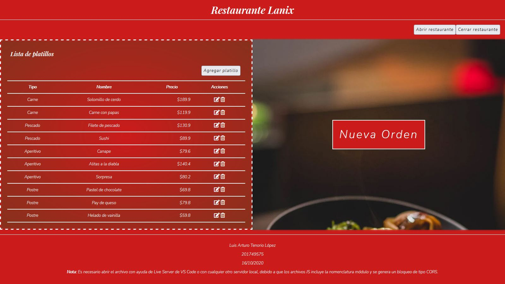
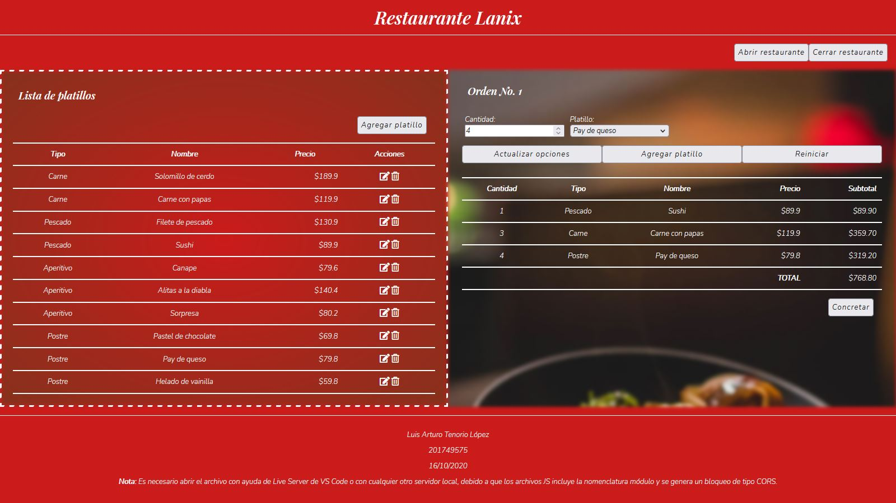
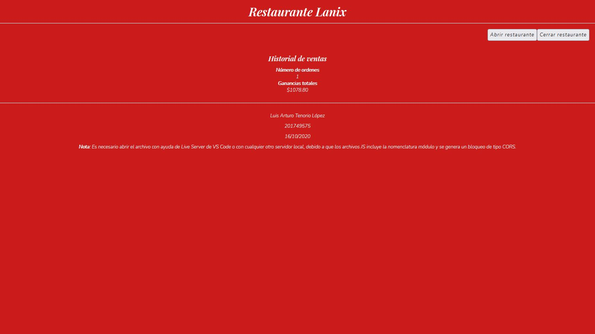

Little vanilla JS application where you can make order in a restaurant and calculate the total of sales on a day.

## Screenshots

1. See the menu and make orders.
   

2. Select dishes from menu.
   

3. Total sales.
   
